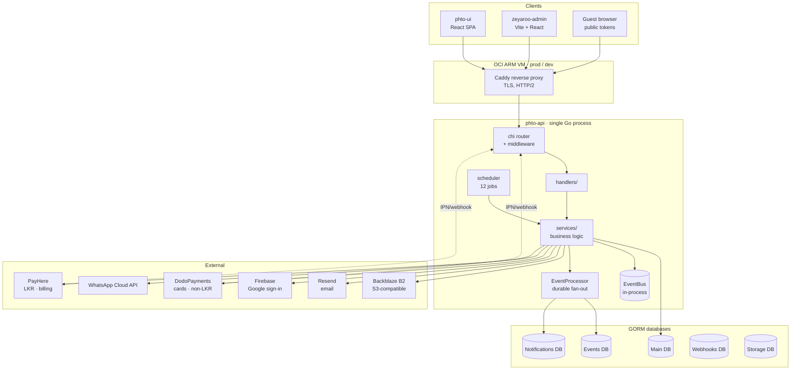
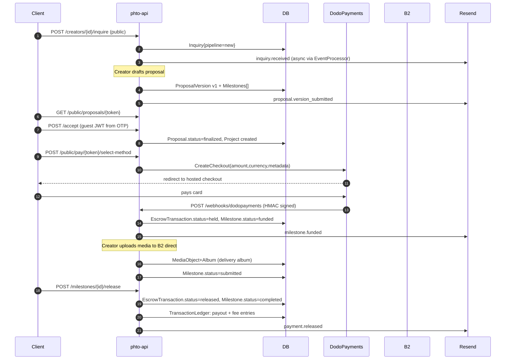

# 2. Architecture

## System diagram

## Major components

### HTTP layer — `internal/handlers/`

chi v5 mux. ~35 handler files, all flat in one package. Every handler is a struct with service dependencies injected via `Set*` methods from `router.go`. The router is assembled in `handlers.NewRouter(cfg, authMw, firebaseAuthMw, firebaseSvc, services)` in [cmd/server/main.go](phto-api/cmd/server/main.go).

Responsibilities: JSON decode/encode, authentication context extraction, delegation to service methods. Handlers do **no** business logic and very little DB access — they are thin adapters.

### Middleware — `internal/middleware/`

Two files only:

- `auth.go` — native JWT (`HS256`, 24 h lifetime), Firebase ID token, share-access token, and guest OTP token. `CombinedAuthenticate` tries JWT first then Firebase, so clients can present either form.
- `ratelimit.go` — per-IP in-memory token buckets. Four instances on the public surface: `authLimiter`, `otpLimiter`, `claimLimiter`, `payLimiter`.

### Services — `internal/services/`

The fat layer. ~60 files. Each domain has its own service struct. Cross-service dependencies are injected with setter methods (rather than constructor parameters) to sidestep circular dependency problems during wiring. The single composition root is `services.NewServices(cfg, dbSet)` in [internal/services/services.go](phto-api/internal/services/services.go).

Notable services:

| Service | Responsibility |
|---------|----------------|
| `AuthService` | Email/password signup + login, holds `OnSignup` hook registry |
| `UserService` | Profile, creator profile, subscription state |
| `ProjectService` | Project CRUD, archive, trash, collaborators, transfer, handover |
| `ProposalService` | Versioned proposals, guest accept, state machine |
| `EscrowService` | Milestone state machine, funding, release, refund, disputes |
| `NotificationService` (in-app) + `EmailNotificationChannel` + `WhatsAppNotificationChannel` | Three parallel notification delivery channels |
| `MediaService` + `ImageProcessing` + `Watermark` | Upload, variants, watermark, delivery access tiers |
| `EventProcessor` | Durable job fan-out with exponential backoff |
| `Scheduler` jobs | 12 periodic jobs registered in `main.go` |

### Data layer

**GORM** with two drivers compiled in: SQLite (dev, default) and Postgres (prod). Schema is created and kept up to date via `AutoMigrate` at every process startup — there is no external migration tool.

Most domain-model DB access is **inline within services** using the injected `*gorm.DB`. Only three tables have dedicated repositories (`internal/repository/`): events, jobs, and webhook sources. The repo/service split is deliberate — domain code treats GORM as the ORM, while infrastructure tables use repositories because they are polled by the event processor loop.

### Storage — `internal/storage/`

A `Provider` interface with three implementations: local disk, S3, and B2 (S3-compatible via custom endpoint). In production, media is on Backblaze B2. The `mediasign` package issues HMAC-SHA256 signed URLs for browser-friendly serving without an `Authorization` header.

### Event systems

There are **two** event systems running in parallel:

1. **EventBus** (`internal/events/bus.go`) — in-process pub/sub, fire-and-forget goroutines. Only used for `media.uploaded` and `media.deleted`, which update storage counters synchronously.
2. **EventProcessor** (`services/event_processor.go`) — durable job queue backed by the `jobs` table in the events DB. Polls every 30 s, dispatches to named handler functions, retries with 2^n-minute backoff up to 5 times. Used for all notifications and image processing.

The `StorageEventHandler` is the bridge — it receives an EventBus call and immediately re-publishes to the EventProcessor for durability.

### Scheduler

`internal/scheduler/` is a simple ticker-per-job implementation. No missed-run compensation: if the process restarts, the next tick fires. 12 jobs are registered in [cmd/server/main.go](phto-api/cmd/server/main.go:162-226):

| Job | Interval |
|-----|----------|
| `cleanup-expired-uploads` | 1 h |
| `downgrade-expired-subscriptions` | 1 h |
| `auto-release-milestones` | 1 h |
| `proposal-reminders` | 1 h |
| `post-delivery-feedback` | 24 h |
| `mark-expired-projects` | 24 h |
| `purge-trash` | 24 h |
| `cleanup-completed-jobs` | 24 h |
| `storage-reconciliation` (projects + users) | 24 h |
| `billing-invoice-generation` | 24 h |
| `billing-auto-finalize` | 24 h |
| `billing-overdue` | 24 h |

## Data flow — the golden path

A canonical end-to-end flow, from first click to money released:

## External dependencies

| Dependency | Library | Purpose | Optional? |
|------------|---------|---------|-----------|
| Firebase Admin SDK | `firebase.google.com/go/v4` | Verify Google sign-in ID tokens | Optional (no key → email/password only) |
| AWS SDK | `github.com/aws/aws-sdk-go` | S3/B2 storage | Required in prod |
| Resend | `github.com/resend/resend-go/v2` | Transactional email | Primary email provider |
| ZeptoMail / SMTP | custom | Email alternatives | Fallback; SMTP for local Inbucket |
| DodoPayments | custom HTTP client | Card checkout for non-LKR | Required for international |
| PayHere | custom | LKR card processing on billing invoices | Optional |
| WhatsApp Cloud API | custom HTTP | Template messages | Optional |
| `chi`, `gorm`, `jwt/v5`, `imaging`, `goexif` | — | Core infrastructure | Required |

## Communication patterns

- **Inbound HTTP**: browser → chi → handler → service. Everything sync.
- **Outbound to gateways**: sync HTTP (Dodo checkout creation, PayHere signature), except payout which is manual.
- **Webhook inbound**: `POST /api/v1/webhooks/{source_name}` — verified per-provider (HMAC for Dodo, MD5 signature for PayHere). Stored raw in the webhooks DB and fanned out as durable jobs.
- **Internal fan-out**: every significant state transition `Publish`es an event to the EventProcessor. Handlers are named (`email:milestone_funded`, `inapp:milestone_funded`, `whatsapp:milestone_funded`) and run as independent retriable jobs.
- **Background cron**: the scheduler's 12 jobs run on a simple ticker. They call service methods directly.

The most important consequence of this design: **failures in notifications cannot block business flows.** An email outage does not prevent milestone release; the job just retries.
