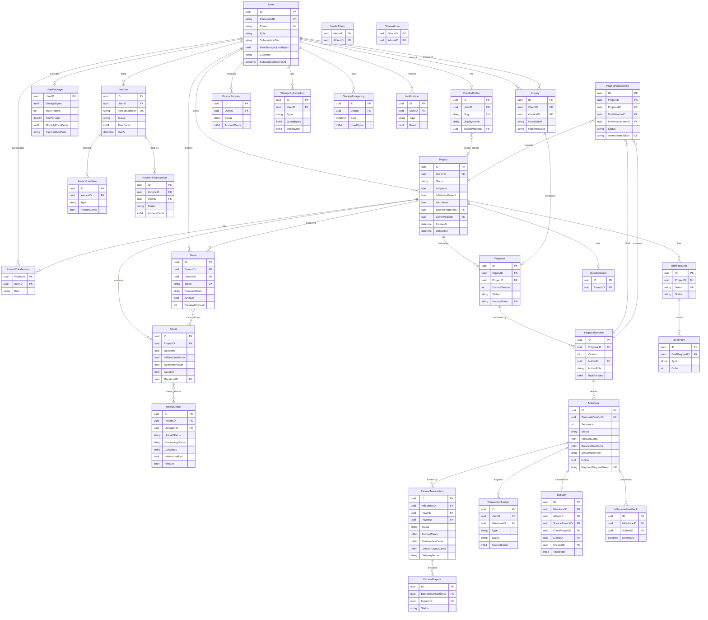
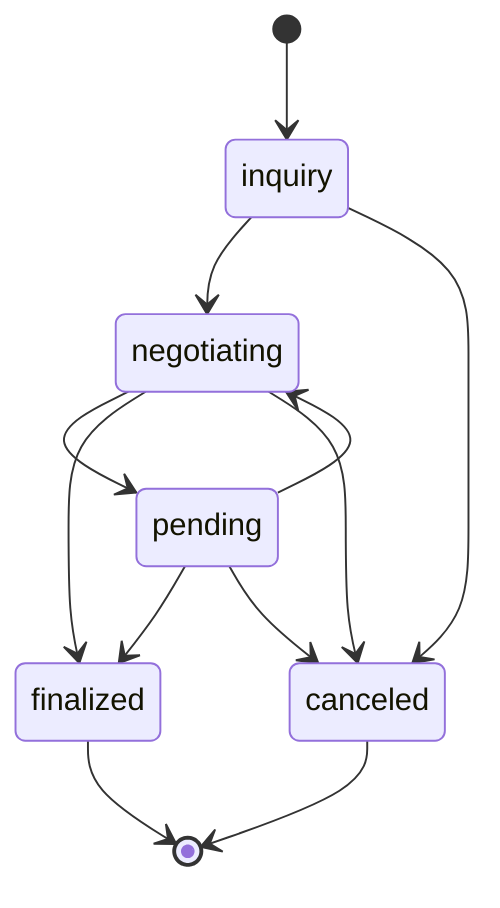
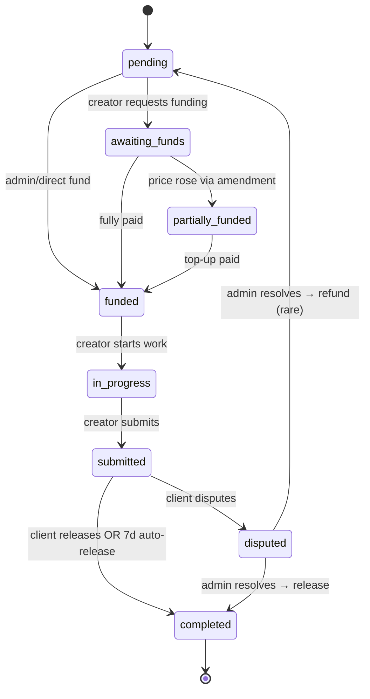

# 4. Data Model

## Core entities

The domain breaks into six clusters. Listed with the entities they contain and the one-line purpose of each.

### Identity & ownership
- `User` — platform account (creator / client / admin)
- `CreatorProfile` — 1:1 public profile for creators (slug, bio, studio project link)
- `UserPackage` — per-user limit overrides (admin deals)

### Work container
- `Project` — central workspace; soft-deletable, archivable, can be a system "studio" project or a delivery project
- `ProjectCollaborator` — composite-PK join table for access control
- `Album` — named media grouping inside a project (milestone album, delivery album, system album)
- `MediaObject` — uploaded photo/video; M2M with Album via `media_albums`
- `Questionnaire` — 1:1 client-facing form per project
- `BriefRequest` / `BriefPoint` — structured shot-list questionnaire

### Negotiation
- `Inquiry` — first client contact (kanban pipeline status)
- `Proposal` — head record per inquiry; has a state machine
- `ProposalVersion` — immutable snapshot per negotiation round
- `Milestone` — work segment with payment and deliverable on a version
- `ProjectAmendment` — proposed mid-project change; references draft and previous versions
- `ProjectTransferRequest` / `ProjectHandover` — creator↔creator and creator→client ownership moves

### Money
- `EscrowTransaction` — held/released/refunded funds per milestone
- `EscrowDispute` — admin-managed dispute
- `TransactionLedger` — append-only double-entry ledger
- `Invoice` / `InvoiceLineItem` / `PaymentTransaction` — platform SaaS billing
- `PayoutRequest` — creator withdrawal
- `PaymentMethod` / `BillingAddress` — stored for billing

### Delivery & sharing
- `Delivery` — immutable audit record per released milestone (maps creator media → client media)
- `Share` — public password-protected gallery link; M2M with Album via `share_albums`
- `Review` — post-project rating
- `MilestoneFeedback` — comment thread on milestone submission (soft-deletable)

### Infrastructure (separate DBs)
- `StoredEvent`, `Job` — durable event/job store (events DB)
- `Notification` — in-app notification row (notifications DB)
- `WebhookSource`, `WebhookAttempt` — inbound webhook config and log (webhooks DB)
- `StorageSubscription`, `StorageUsageLog`, `StoragePlanChange` — storage billing (storage DB)
- `VerificationCode` — email OTP

## ER diagram

## State machines

Enum values are defined in [internal/models](phto-api/internal/models/). Statuses are strings, not DB enums — validation is in the service layer.

### Project
`inquiry` → `negotiation` → `active` → `completed` | `cancelled`

### Proposal

### Milestone

### Escrow
`pending` → `held` → `released` | `refunded` | `disputed`

### Amendment
`draft` → `pending_approval` → `applied` | `rejected` | `cancelled`

### Invoice
`draft` → `finalized` → `pending_approval` → `paid` | `overdue` | `canceled`

## Migration strategy

- **No external migration tool.** GORM `AutoMigrate` runs on all five DBs at every startup, via `database.Migrate`, `MigrateEvents`, `MigrateNotifications`, `MigrateWebhooks`, `MigrateStorage`. Foreign keys are disabled during the call to avoid ordering issues.
- **Additive changes are safe.** New tables, columns, and indexes "just work" after a redeploy.
- **Destructive changes are not safe.** Column rename / type change / drop → write the SQL by hand. For that reason there is one embedded backfill in `Migrate()`: the `payment_request_token = NULL` update at [database.go:127](phto-api/internal/database/database.go#L127), run before the new unique index was added.
- **Seeds.** `SeedAdmin()` creates the admin user once at boot from `ADMIN_EMAIL` / `ADMIN_PASSWORD`. No other seed data.
- **One-shot backfill script** lives at [cmd/migrate-studio/main.go](phto-api/cmd/migrate-studio/main.go) — creates "My Studio" project and "Portfolio" album for legacy creator profiles. Run manually.

## Multi-tenancy & scoping

There is **no schema-per-tenant**. All users share the same tables. Scoping is by `OwnerID` / `CreatorID` at the query level.

- **Projects** scope by `OwnerID` plus presence in `project_collaborators`.
- **Albums / MediaObjects / BriefRequests / Questionnaires / Shares** transitively scope through `ProjectID`.
- **Inquiries** scope by `CreatorID`; `ClientID` is nullable so guests can inquire via `GuestEmail`.
- **Guests** appear in two tables: `Inquiry.ClientID IS NULL` and `EscrowTransaction.PayerID IS NULL`. Both have `GuestEmail` text fallbacks. Guest sessions are OTP-driven with a 24 h JWT where `role = guest`.

## Soft delete, archive, trash

| Entity | Mechanism |
|--------|-----------|
| `Project` | `gorm.DeletedAt` + `IsArchived` + `ExpiresAt` + `IsProtected` |
| `MilestoneFeedback` | `gorm.DeletedAt` |
| `MediaObject` | `CullStatus = reject` acts as trash; `PurgeRejected()` hard-deletes |
| `Album` | `IsLocked` freezes (used by delivery albums) |
| `Share` | `IsActive` + `ExpiresAt` for deactivation without deletion |

The `purge-trash` scheduler job hard-deletes soft-deleted projects past retention. Deletion cascade order matters — see [Gotchas](phto-api/gotchas.md).
